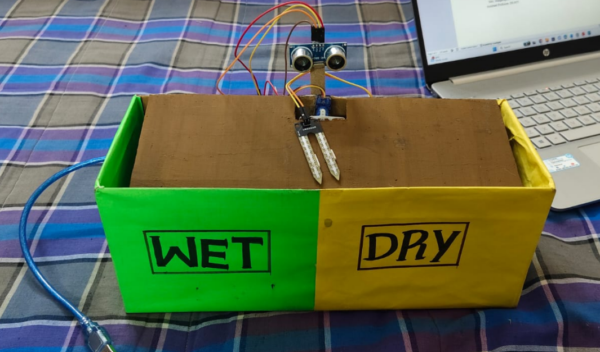
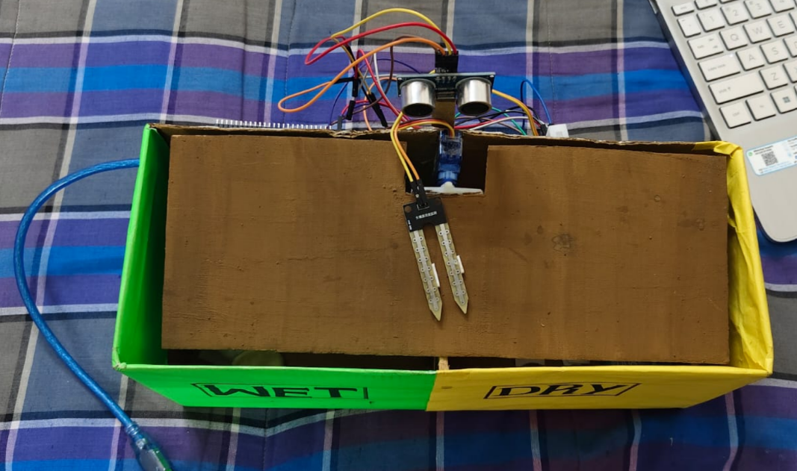

# ♻️ Smart Waste Segregation System

An Arduino-based IoT prototype that automatically detects and segregates waste into **wet and dry categories** using an ultrasonic sensor, soil moisture sensor, and servo motor.

## 📌 Project Overview

Waste segregation at the source is important for effective waste management and recycling.

This project provides a simple automated solution that:

* 📡 Detects the presence of waste
* 💧 Measures the moisture level of the waste
* 🔄 Classifies waste as wet or dry
* ⚙️ Automatically directs the waste using a servo motor

The system is designed as a **low-cost prototype for educational and IoT applications**.

---

## 🎯 Objectives

* ♻️ Automate basic wet and dry waste segregation
* 📡 Detect waste using an ultrasonic sensor
* 💧 Identify moisture content using a soil moisture sensor
* ⚙️ Control waste direction using a servo motor
* 💻 Display sensor readings through the Arduino Serial Monitor
* 💰 Develop a simple and affordable prototype

---

## 🛠️ Components Used

| Component                 | Purpose                                    |
| ------------------------- | ------------------------------------------ |
| Arduino UNO               | Main controller                            |
| HC-SR04 Ultrasonic Sensor | Detects waste presence                     |
| Soil Moisture Sensor      | Determines moisture level                  |
| SG90 Servo Motor          | Directs waste into the appropriate section |
| Jumper Wires              | Circuit connections                        |
| 5V Power Supply           | Powers the components                      |

---

## 🔌 Pin Connections

| Component            | Arduino UNO |
| -------------------- | ----------- |
| HC-SR04 Trig         | D8          |
| HC-SR04 Echo         | D9          |
| Soil Moisture Sensor | A0          |
| Servo Signal         | D6          |
| VCC                  | 5V          |
| GND                  | GND         |

---

## ⚙️ Working Principle

The system follows these steps:

```text
        🗑️ Waste Placed
              ↓
       📡 Ultrasonic Sensor
              ↓
       Waste Detected?
              ↓
       💧 Moisture Reading
              ↓
       ┌──────┴──────┐
       ↓             ↓
   💦 Wet Waste   🏜️ Dry Waste
       ↓             ↓
   Servo 45°      Servo 135°
       ↓             ↓
       └──────┬──────┘
              ↓
       Waste Segregated
              ↓
        Servo → 90°
              ↓
       Ready for Next Waste
```

### 🔹 Waste Detection

The HC-SR04 ultrasonic sensor measures the distance between the sensor and the waste.

If the measured distance is less than **15 cm**, the system considers that waste has been detected.

### 🔹 Waste Classification

The soil moisture sensor provides an analog moisture value.

* **Moisture value < 950 → Wet Waste**
* **Moisture value ≥ 950 → Dry Waste**

The threshold can be calibrated according to the actual sensor readings.

### 🔹 Automatic Segregation

The servo motor changes its position according to the detected waste type:

* 💧 Wet waste → **45°**
* 🏜️ Dry waste → **135°**
* 🔄 After disposal → **90°**

---

## 💻 Technologies Used

* Arduino UNO
* Embedded C / Arduino C++
* Ultrasonic sensing
* Moisture sensing
* Servo motor control
* Serial Monitor

---

## 📸 Prototype

### Prototype 1



### Prototype 2



---

## 📊 Sample Output

The Arduino Serial Monitor displays sensor readings such as:

```text
================================
 Smart Waste Segregation System
================================
System Ready

Distance: 12 cm | Moisture: 380
Waste Detected!
Moisture Value: 380
WET WASTE DETECTED
Servo moving to 45 degrees
Wet waste directed.
Returning servo to center
Ready for next waste.
--------------------------------
```

For dry waste, the system displays:

```text
Distance: 10 cm | Moisture: 823
Waste Detected!
Moisture Value: 823
DRY WASTE DETECTED
Servo moving to 135 degrees
Dry waste directed.
Returning servo to center
Ready for next waste.
--------------------------------
```

> **Note:** Moisture values may vary depending on the sensor, material, and environmental conditions. The classification threshold should be calibrated during testing.

---

## 📂 Project Structure

```text
Smart Waste Segregation/
│
├── images/
│   ├── prototype_1.png
│   └── prototype_2.png
│
├── report/
│   └── Smart_Waste_Segregation_Report.pdf
│
├── .gitignore
├── README.md
└── smart_waste_segregation.ino
```

---

## 📄 Project Report

📑 [View Project Report](report/Smart_Waste_Segregation_Report.pdf)

---

## 🚀 Future Scope

The prototype can be further improved by adding:

* 📱 IoT-based monitoring
* 📊 Waste collection analytics
* 🌐 Cloud dashboard
* 🧠 AI-based waste classification
* 📷 Camera-based object recognition
* 🔔 Full-bin detection and alerts
* 🔋 Improved power management
* 🗑️ Additional waste categories

---

## 🎓 Applications

The concept can be adapted for:

* 🏫 Educational institutions
* 🏠 Smart homes
* 🏢 Offices
* 🏥 Hospitals
* 🏭 Industrial environments
* 🌆 Smart-city waste management

---

## 👩‍💻 Author

**Sanjana M Kanaki**

B.Tech – IoT Specialization
GM University

---

## ⭐ Project

If you find this project useful for learning about Arduino, IoT, and automated waste management, consider giving the repository a ⭐.
